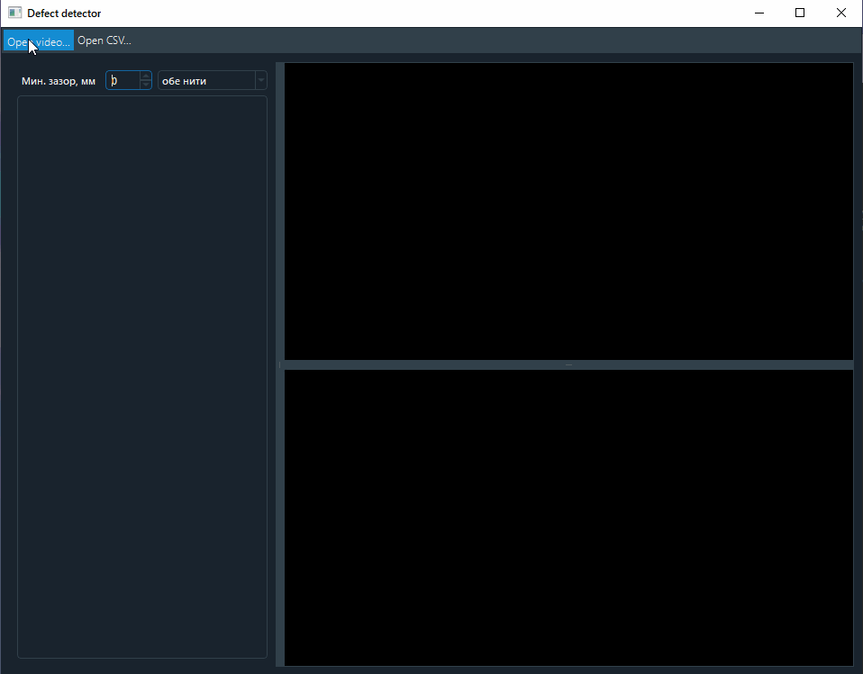

# Проект Defect detector
*Поиск неисправностей ЖД пути по видео*

Проект выполнен в рамках хакатона **"Стартап депо"**.  
г.Хабаровск 11-13 декабря 2020 года.

## Задача
Необходимо проанализировать видеофайл со съемкой ЖД-пути, и найти на нем неисправности. [Подробное задание](docs/задание.md)


## Структура проекта

1) Поиск стыков методом поиска прямых линий в кадре
2) Строим маршрут рельса, и ищем типичные (для стыка) отклонения
3) Детекция объектов (стык, болт) на фотографии со стыком
4) Разработка GUI приложения


## Как запустить
1) Скачать исходные данные и обученную модель из [этого файла](https://drive.google.com/file/d/10fy1fkY_BXHtykaI0ml0b4OKg_Mw8XW8/view?usp=sharing), положить их в директорию `data` в корне проекта  
2) Установить программу `Tesseract OCR` [отсюда](https://digi.bib.uni-mannheim.de/tesseract/)
3) В файле `4. GUI application\config.py` указать путь до exe-файла tesseract
```
pytesseract.pytesseract.tesseract_cmd = r"C:\ПУТЬ\ДО\КАТАЛОГА\УСТАНОВКИ\tesseract.exe"
```
5) Установить необходимые библиотеки python
```
pip install -r "4. GUI application\requirements.txt"
pip install torch==1.7.1+cpu torchvision==0.8.2+cpu torchaudio===0.7.2 -f https://download.pytorch.org/whl/torch_stable.html
git clone https://github.com/DGMaxime/detectron2-windows.git
pip install -e detectron2-windows
```
* строка установки pytorch определяется на [сайте pytorch](https://pytorch.org/get-started/locally/)
* detectron2 устанавливается  из неофициально форка (официальная версия не поддерживает платформу Windows)

6) Запустить программу 
```
python "4. GUI application\defect_detector.py"
```


**Блоконоты jupyter notebook из разделов 1, 2 и 3 запускались в среде Anacondа**  
Установка зависимостей, если это требуется, проиходит прямо в них.

## Примеры работы



## Состав команды

* Антон Фролов
* Кирилл Шоберг
* Юрий Сухобок
* Роман Заболотин


## Презентация и выступление

* [Презентация 1]("docs/Презентация.pptx")
* [Презентация 2]("./docs/Детекция пути.pdf")
* [Текст выступления]("docs/Доклад к презентации.docx")

## Результат 

**Победа в хакатоне**
